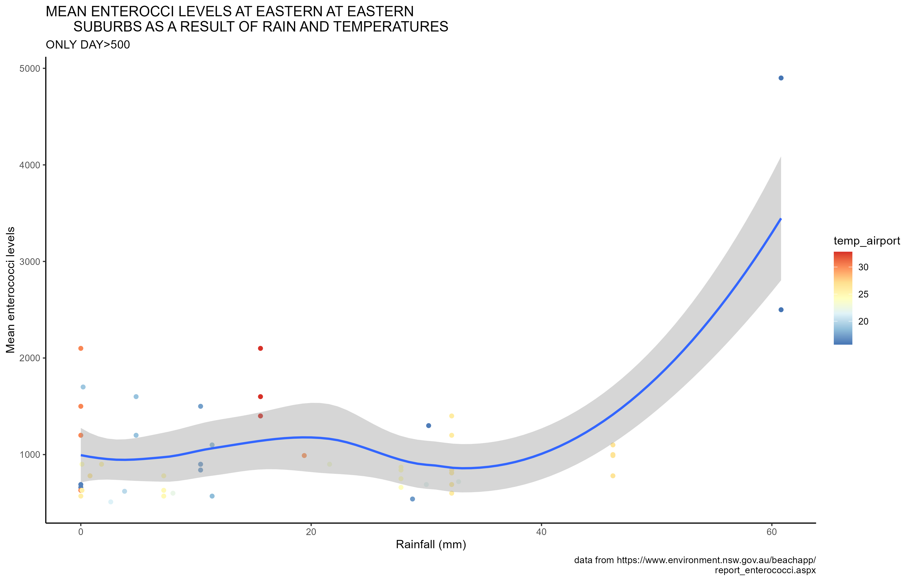

```{r setup, include=FALSE}
knitr::opts_chunk$set(echo = TRUE)
```

# one hash for big headings
## for smaller headings
### three hash for headings
#### and so on and so on....

# Bold and italics

you can also make things bold and ital using asterik on either side of the text.
Use two asterisk for bold and one for ital

**I want this to be bold**

# Bullets points with dashes

- bullet 1
- bullet 2
- bullet 3

Don't forget to put a space after a dash to get bullets.

# quotes
>"There is no such a thing like silly question-Jen Richmond,R-Ladies Sydney"
# Link
You can insert links with a combination of round and square brackets.Put the
text in square brackets and the orl in round brackets.

You can find resource from our RMarkdownThrowdown event at [Jen's github](https://github.com/jenrichmond/RMarkdownThrowdown).

# pictures 
Use ''

## Tweets
use embed code from Twitter to insert tweets
<blockquote class="twitter-tweet" data-media-max-width="560"><p lang="en" dir="ltr">This vehicle was know for what, let me see the freedom fighters 👋 <a href="https://t.co/Pyi7YHR2cP">pic.twitter.com/Pyi7YHR2cP</a></p>&mdash; Bamack (@Bamack323043) <a href="https://twitter.com/Bamack323043/status/1767677991478338014?ref_src=twsrc%5Etfw">March 12, 2024</a></blockquote> <script async src="https://platform.twitter.com/widgets.js" charset="utf-8"></script>
## Gif
use embed code
<iframe src="https://giphy.com/embed/WNuGcLaiYSrzGxD39l" width="480" height="480" style="" frameBorder="0" class="giphy-embed" allowFullScreen></iframe><p><a href="https://giphy.com/gifs/happy-birthday-selamat-ulang-tahun-feliz-aniversrio-WNuGcLaiYSrzGxD39l">via GIPHY</a></p>


